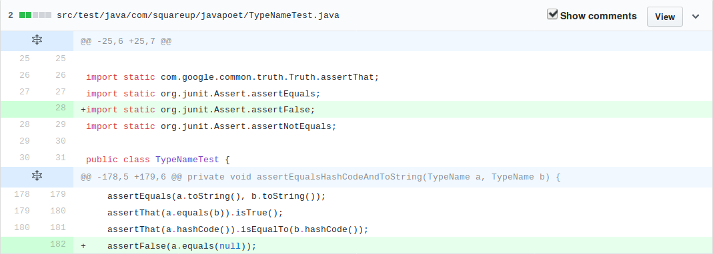
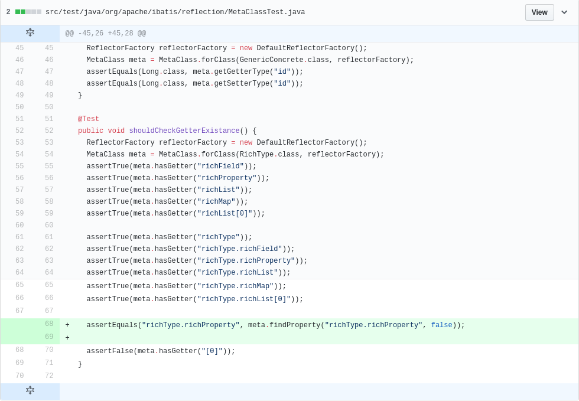
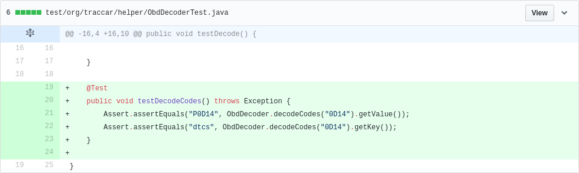
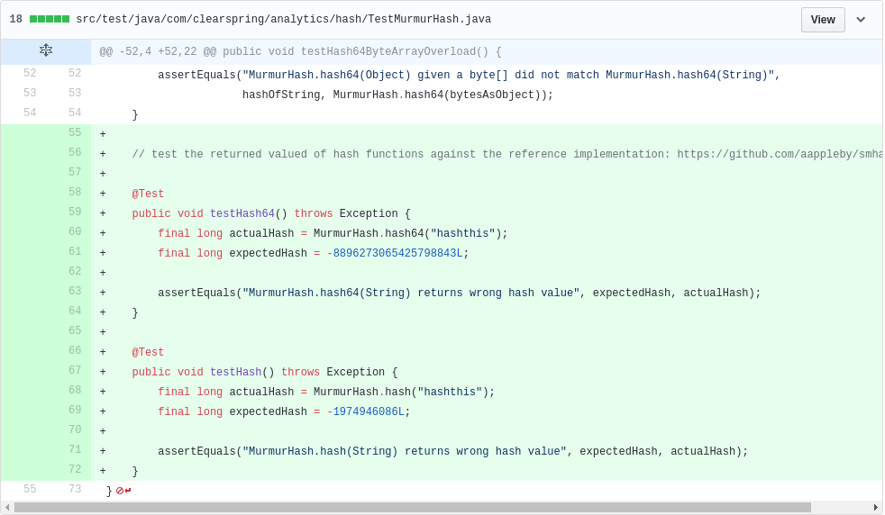
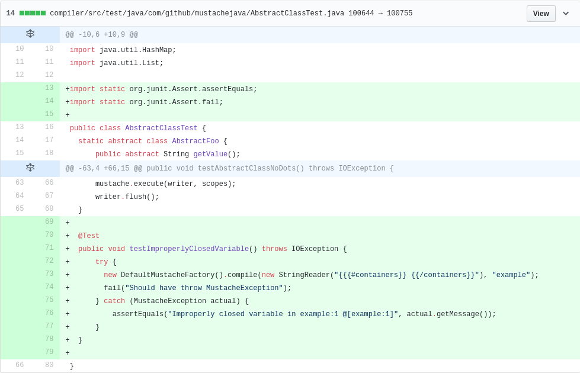
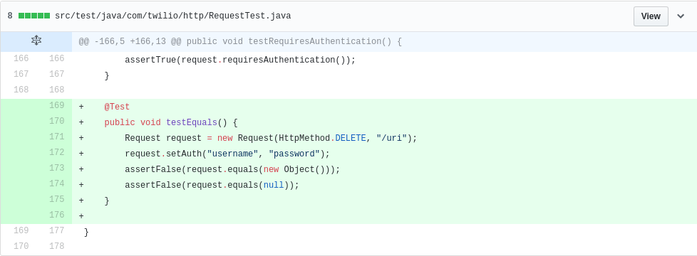
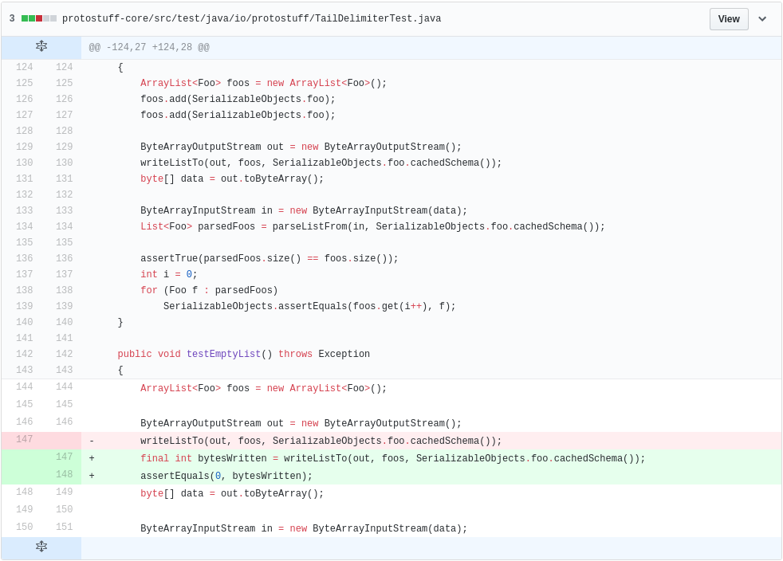
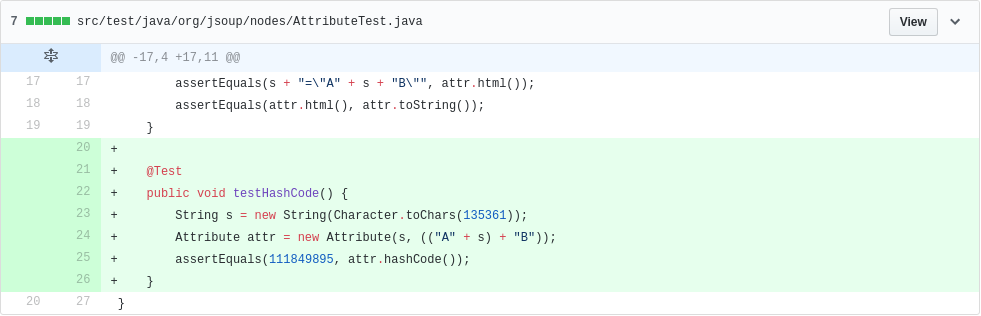
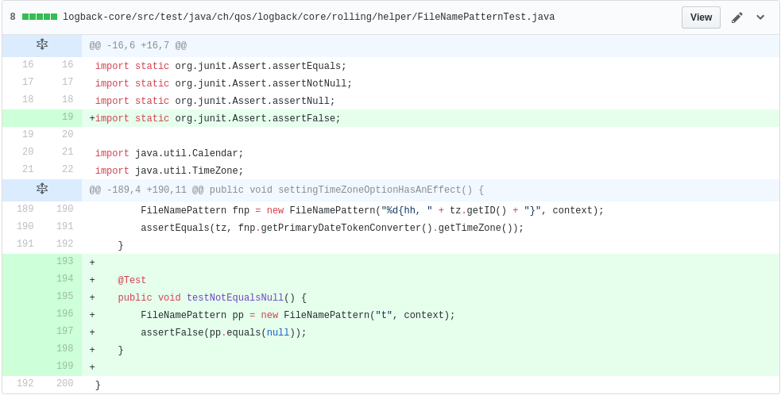

# DSpot Success Stories

In this file, we list success stories about the amplification done with DSpot.

## Pull request accepted by developers

In this section, we list all amplified test that has been accepted by developers. The amplification done by DSpot is now in the test suite of these open-source projects. Thank to them to give us nice feedback on the performance of DSpot.

### Javapoet
[square/javapoet#544](https://github.com/square/javapoet/pull/544/files)

### mybatis-3
[mybatis/mybatis-3#912](https://github.com/mybatis/mybatis-3/pull/912/files)

### traccar
[tananaev/traccar#2897](https://github.com/tananaev/traccar/pull/2897/files)

### stream-lib
[addthis/stream-lib#2897](https://github.com/addthis/stream-lib/pull/127/files)

### mustache.java
[spullara/mustache.java#186](https://github.com/spullara/mustache.java/pull/186/files)

[commit done by developer](https://github.com/spullara/mustache.java/commit/9efa19d595f893527ff218683e70db2ae4d8fb2d)

### twilio-java
[twilio/twilio-java#334](https://github.com/twilio/twilio-java/pull/334/files)

### protostuff
[protostuff/protostuff/#544](https://github.com/protostuff/protostuff/pull/212/files)

## Pull request refused or not (yet) accepted by developers

Because any success can be done without failure, we list here, pull requests that has been refused or not yet accepted by developers.

### jsoup
[jhy/jsoup#840](https://github.com/jhy/jsoup/pull/840)

### logback
[qos-ch/logback/#365](https://github.com/qos-ch/logback/pull/365)

